- [С чего начать](#с-чего-начать)
- [Структура проекта](#структура-проекта)
- [Создание проекта](#создание-проекта)
- [MVC](#mvc-mvt)
- [Routing](#routing)
- [Работа с моделью (с базой данных Postgres)](#работа-с-моделью-с-базой-данных-postgres)
  - [Подключение Postgres](#подключение-postgres)
  - [Миграции](#миграции)


# С чего начать
Попробуем создать сайт кинотеатра с помощью django.

Для начала создадим виртуальное окружение, активируем его и установим django 2.x.

```bash
virtualenv django_2.2 
source ./django_2.2/bin/activate

pip list

Package    Version
---------- -------
pip        20.0.2 
setuptools 46.0.0 
wheel      0.34.2 
```
Для работы с django необходимо собственно этот фреймворк установить в наше созданое виртуальное окружение. Мы будем работать с django 2.2
```bash
pip install django==2.2

Package    Version
---------- -------
Django     2.2    
pip        20.0.2 
pytz       2019.3 
setuptools 46.0.0 
sqlparse   0.3.1  
wheel      0.34.2 
```
Находясь в любой папке, выполним команду, которая создаст необходимую структуру файлов и каталогов для проекта:

`django-admin startproject project_name`
```bash
django-admin startproject cinema
.
├── cinema
│   ├── __init__.py
│   ├── settings.py
│   ├── urls.py
│   └── wsgi.py
└── manage.py
```
Уже сейчас мы можем запустить наше приложение:
```bash
python manage.py runserver
```
Без дополнительных параметров будет запущен встроенный web-сервер для нужд разработчика, который будет слушать запросы на localhost:8000 (8000 - порт). Если перейти по ссылке http://localhost:8000 - браузер отобразит главную страницу сайта.

Что означает для нужд разработчика? Другими словами, это dev-сервер, который нельзя использовать в промышленной эксплуатации (в продакшене - production).

Для удобства django предполагает разделение проекта (project) на приложения (applications). Для этого в основной структуре можно создавать приложения (applications) с помощью команды:

`python manage.py startapp myapp_name`

В нашем случае, мы хотим создать отдельное приложение для регистрации и аутентификации:
```bash
python manage.py startapp authenticate

.
├── authenticate
│   ├── __init__.py
│   ├── admin.py
│   ├── apps.py
│   ├── migrations
│   │   └── __init__.py
│   ├── models.py
│   ├── tests.py
│   └── views.py
├── cinema
│   ├── __init__.py
│   ├── __pycache__
│   │   ├── __init__.cpython-37.pyc
│   │   └── settings.cpython-37.pyc
│   ├── settings.py
│   ├── urls.py
│   └── wsgi.py
└── manage.py

```

После того, как приложение добавлено, необходимо его зарегистрировать в settings.py:
```python
INSTALLED_APPS = [
    'django.contrib.admin',
    'django.contrib.auth',
    'django.contrib.contenttypes',
    'django.contrib.sessions',
    'django.contrib.messages',
    'django.contrib.staticfiles',
    'authenticate',
]
```

# Пара слов о концепции Django
Джанго предполагает разделение данных, отображения и логики обработки данных. Официально такой подход называется `Model-View -Controller` (MVC) - модель (данные и их организация), отображение (вывод и отображение данных), логика (вычисления, помещение данных в БД).

MVC - это шаблон проектирования (он же паттерн - pattern).

В Django имеет место путаница, т.к. MVC называют `MVT - Model-View-Template` (Модель-Представление-Шаблон). Однако, View в Django скорее выполняет функцию контроллера, а Template - представления.

Суть разделения представления, данных и логики в том, чтобы во-первых было проще сосредоточиться на конкретной задаче, а во-вторых, чтобы можно было разделить задачи между несколькими людьми или даже командами.

Собственно, в проекте и в приложениее (project и application) имеются соответствующие файлы:
- models.py
- views.py
- templates (каталог для шаблонов)

# Routing (роутинг) - urls
Routing (маршрутизация) urls - это навигация по сайту. Другими словами, это пути в адресной строке браузера, с помощью которых мы переходим по страницам. Пути могут быть статическими и динамическими. Фактически, через url вида https://cinema.com/movie/55 мы передаём переменные: movie раздел фильмов, 55 - id фильма (уникальный идентификатор фильма).

Хорошая практика разделять роутинг между приложениями. Так проще управлять роутингом, находить ошибки, в целом проектировать роутинг.

Для этого необходимо выполнить следующие шаги:

- Создать файл urls.py в корне папки authenticate
- Импортировать в cinema/urls.py модуль include
```python
from django.urls import path, include
```
- подключить ("заинклюдить") файл authenticate/urls.py
```python
urlpatterns = [
  path('authenticate/', include('authenticate.urls'))
]
```
В общем виде файл cinema/urls.py выглядит так
```
from django.contrib import admin
from django.urls import path, include

urlpatterns = [
    path('admin/', admin.site.urls),
    path('authenticate/', include('authenticate.urls'))
]
```
В данном проекте мы будем придерживаться Объектно Ориентированой Парадигмы (ООП)

Первым делом необходимо создать "обработчик" (view) для регистрации пользователя. Регистрация - это процесс создания и записи в базу данных информации о пользователе (username, password, email etc.)
В django "из коробки" есть форма и модель для создания пользователя.

Начнем с расширения базовой модели AbstractUser.
Эта модель идентична базовой модели User, но основное ее отличие в том, что модель AbstractUser в будущем можно расширить. Поэтому рекомендуется при создании нового проекта использовать модель AbstractUser.

В файл authenticate/models.py импортируем модель AbstractUser
```
from django.contrib.auth.models import AbstractUser
```
и если нам не нужны дополнительные поля то после объявления класса, ставим оператор pass.
```
class User(AbstractUser):
    pass
```
(посмотреть поля реализованые в классе AbstractUser можно нажав правой кнопкой мыши и выбрав Go to defenition)

Для того чтобы джанго рассматривал эту модель как пользователя, в settings.py нужно указать AUTH_USER_MODEL = 'authenticate.User'

После создания любой модели, необходимо выполнить миграцию. Миграция это перенос изменения в моделях на структуру базы данных. Следует рассматривать миграции, как систему контроля версий для базы данных. makemigrations отвечает за сохранение состояния моделей в файле миграции - аналог коммита - а migrate отвечает за их применение к базе данных.

Модель создана, можем выполнить миграцию. Находясь в корне проекта, выполняе команду 
```
python manage.py migrate
```
вывод в консоль
```
Operations to perform:
  Apply all migrations: admin, auth, contenttypes, sessions
Running migrations:
  Applying contenttypes.0001_initial... OK
  Applying auth.0001_initial... OK
  Applying admin.0001_initial... OK
  Applying admin.0002_logentry_remove_auto_add... OK
  Applying admin.0003_logentry_add_action_flag_choices... OK
  Applying contenttypes.0002_remove_content_type_name... OK
  Applying auth.0002_alter_permission_name_max_length... OK
  Applying auth.0003_alter_user_email_max_length... OK
  Applying auth.0004_alter_user_username_opts... OK
  Applying auth.0005_alter_user_last_login_null... OK
  Applying auth.0006_require_contenttypes_0002... OK
  Applying auth.0007_alter_validators_add_error_messages... OK
  Applying auth.0008_alter_user_username_max_length... OK
  Applying auth.0009_alter_user_last_name_max_length... OK
  Applying auth.0010_alter_group_name_max_length... OK
  Applying auth.0011_update_proxy_permissions... OK
  Applying sessions.0001_initial... OK
```

Посмотреть созданную модель мы можем в админ-панели джанго.
Но попасть в нее можно только под учетной записью суперпользователя, которую мы сейчас создадим.
В консоли выполняем:
```
python manage.py createsuperuser
```
вводим данные:
```
Username : superuser
Email address: superuser@mail.com
Password: 
Password (again):
Superuser created successfully.
```
В адрессной строке пишем http://localhost:8000/admin/ и вводим данные созданого суперпользователя.

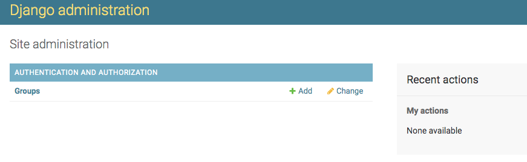

Чтобы в админ панели отображалась наша кастомная модель юзера, ее нужно зарегестрировать в файле admin.py нашег приложения authenticate.

```
from django.contrib import admin
from .models import User

# Register your models here.

admin.site.register(User)
```

Теперь наша админка имеет такой вид 

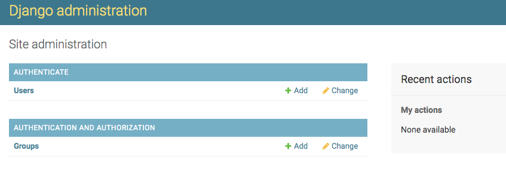


Сделаем отображение формы регистрации. Как мы знаем Джанго использует паттерн проэктирования MVT.
Для templates нужно создать папку в корне нашего проекта

```
.
├── authenticate
├── cinema
├── db.sqlite3
└── manage.py

mkdir templates

.
├── authenticate
├── cinema
├── db.sqlite3
├── manage.py
└── templates
```
в файле settings.py в списке TEMPLATES по ключу DIRS необходимо указать название нашей папки 'templates'

```

TEMPLATES = [
    {
        'BACKEND': 'django.template.backends.django.DjangoTemplates',
        'DIRS': ['templates', ],
        'APP_DIRS': True,
        'OPTIONS': {
            'context_processors': [
                'django.template.context_processors.debug',
                'django.template.context_processors.request',
                'django.contrib.auth.context_processors.auth',
                'django.contrib.messages.context_processors.messages',
            ],
        },
    },
]
```

это означает, что все шаблоны Джанго будет искать в этой папке.
Для шаблонов каждого приложения принято создавать одноименные папки.

```

cd templates/
mkdir authenticate
tree -L 2
.
├── authenticate
│   ├── __init__.py
│   ├── __pycache__
│   ├── admin.py
│   ├── apps.py
│   ├── migrations
│   ├── models.py
│   ├── tests.py
│   ├── urls.py
│   └── views.py
├── cinema
│   ├── __init__.py
│   ├── __pycache__
│   ├── settings.py
│   ├── urls.py
│   └── wsgi.py
├── db.sqlite3
├── manage.py
└── templates
    └── authenticate
```

так же создадим базовый шаблон от которого будут наследоваться все остальные

находясь в папке templates создадим файл base.html от которого будут наследоваться все остальные шаблоны

```

touch base.html

.
├── authenticate
└── base.html
```

в файле base.html создаем базовую структуру

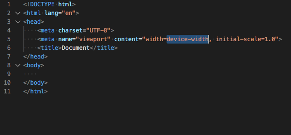

в base.html в html теге body впишем теплейт тег (teplate tag) . Каждый темплейт тег нужно закрывать 

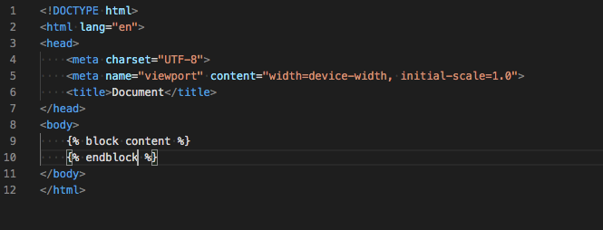

в папке templates/authenticate создадим файл register.html

```
.
├── authenticate
└── base.html
cd authenticate/
touch register.html
tree
.
├── authenticate
│   └── register.html
└── base.html
```

в котором при помощи теплейт тегов "пронаследуемся" от base.html
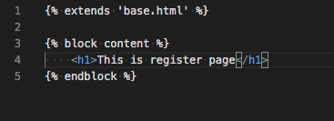

Нам необходимо отобразить форму для регестрации пользователя. Для этого в Джанго служит файл forms.py который нам нужно создать.
Переходим в приложение authenticate

```

cd authenticate
touch forms.py
.
├── __init__.py
├── __pycache__
├── admin.py
├── apps.py
├── forms.py
├── migrations
├── models.py
├── tests.py
├── urls.py
└── views.py

```

В файле forms.py выполняем следущие импорты и создаем класс отвечающий за отображение формы

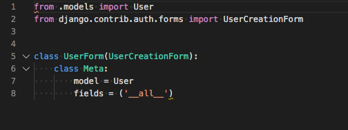

в файле views.py создаем класс отвечающий за рендеринг нашей формы

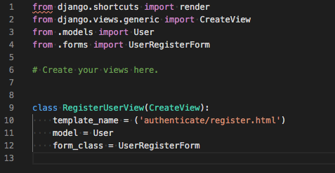

в register.html
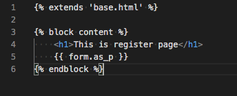

запускаем сервер

```

python manage.py runserver

```

в адрессной строке

```

http://loalhost:8000/authenticate/register/

```

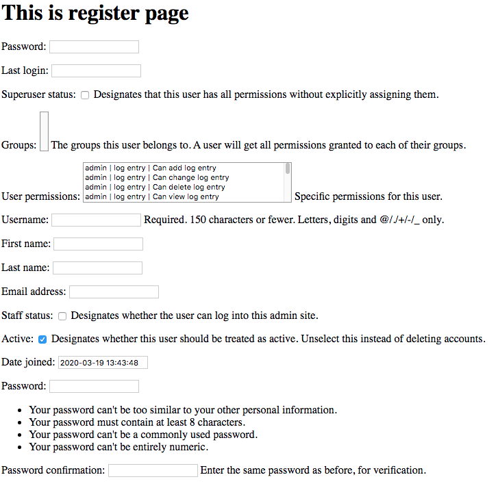

Нам пока не нужны все поля для регистрации пользователя, поэтому в forms.py в fields указываем поля которые хотим задействовать (на самом деле достаточно указать только username, password и password confirmation джанго подставит по умолчанию )

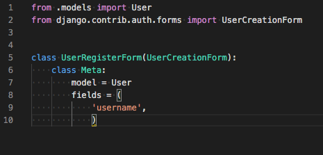

Чтобы зарегестрировать пользователя необходимо данные введенные в браузере отправить нашей RegisterUserView методом POST. Для этого в файле register.html темплейт тег {{ form }} нужно поместить в html тег form и добавить  тег input submit

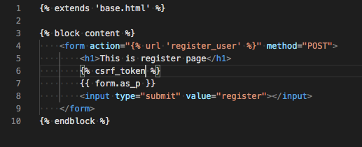

где action - это url на который методом POST будут отправлены данные пользователя, а  - защита от межсайтовой подделк запроса (обязательный тег для отправки формы методом POST)


Проверим через админ панель, создаются ли учетные записи пользователей. Заполняем поле регистрации в браузере

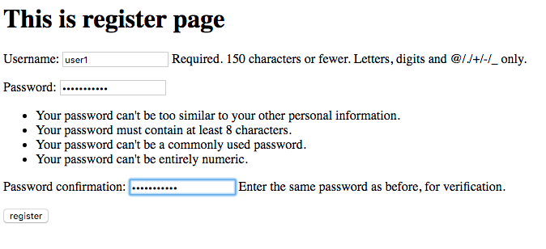

и переходим в админ панель
```
http://127.0.0.1:8000/admin/
```

заходим под суперпользователем, кликаем на поле Users

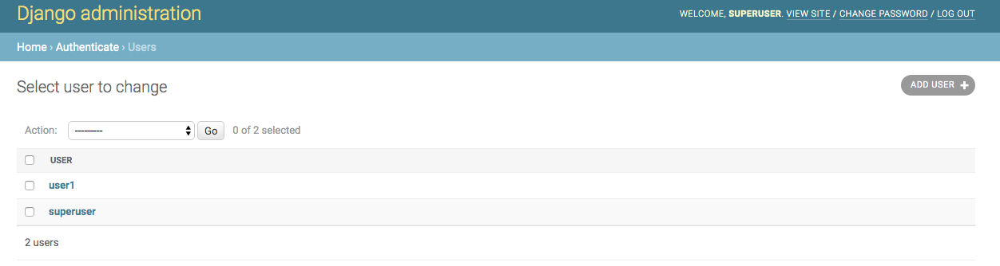

как видим, запись пользователя создалась успешно.

Следущий шаг - аутентификация пользователя.
Аутентификация - это предоставление данных о пользователе для дальнейшей проверки на соответствие с данными внесенными в базу данных.

Создадим обработчик:
```

authenticate/views.py

from django.contrib.auth.views import LoginView

class LoginUserView(LoginView):
    template_name = ('authenticate/login.html')
```

Роутинг:
```
authenticate/urls.py

from django.urls import path
from .views import RegisterUserView, LoginUserView

urlpatterns = [
    path('register/', RegisterUserView.as_view(), name='register_user'),
    path('login/', LoginUserView.as_view(), name='login_user'),
]
```

Шаблон:
```
cd templates/authenticate/
touch login.html
```

login.html:
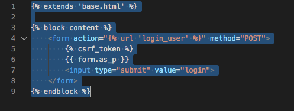

Осталось рассмотреть разлогинивание(я не знаю как сказать иначе. уже поздно и я под устал. ))))

Обработчик:
```
authenticate/views.py

from django.contrib.auth.views import LoginView,LogoutView

class LogoutUserView(LogoutView):
    pass
```

Роутинг:
```
from django.urls import path
from .views import RegisterUserView, LoginUserView, LogoutUserView

urlpatterns = [
    path('register/', RegisterUserView.as_view(), name='register_user'),
    path('login/', LoginUserView.as_view(), name='login_user'),
    path('logout/', LogoutUserView.as_view(), name='logout_user'),
]
```
Итог

У нас готова простейшая система регистрации и аутентификации которую можно расширять. Дальше будем создавать приложение самого кинотеатра и попутно разбираться с html версткой


# Структура проекта

# Создание проекта и его структура

# MVC (MVT)

# Routing

# Работа с моделью (с базой данных Postgres)
## Подключение Postgres
## Миграции
